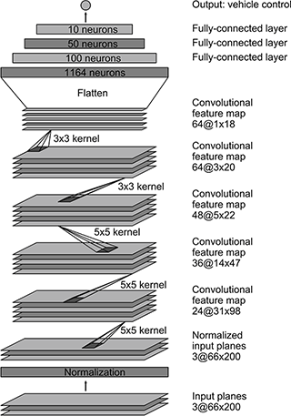

# Behavioral Cloning - Writeup

## Goals

The goals/steps of this project are the following:

- Use the simulator to collect data of good driving behavior.
- Build, a convolution neural network in [Keras](https://keras.io/) that predicts steering angles from images.
- Train and validate the model with a training and validation set.
- Test that the model successfully drives around track one without leaving the road.
- Summarize the results with a written report.

## Rubric points

Here I will consider the [rubric points](https://review.udacity.com/#!/rubrics/432/view) individually and describe how I addressed each point in my implementation.

### Files Submitted & Code Quality

#### 1. Submission includes all required files and can be used to run the simulator in autonomous mode
My project includes the following files:

- **model.py** : Containing the script to create and train the model
- **drive.py** : For driving the car in autonomous mode in the simulator 
- **model.h5** : Containing a trained convolution neural network.
- **writeup_report_bk.md** : Summarizing the results

Node:

On my first iteration, I tried [LeNet](http://yann.lecun.com/exdb/lenet/) model and [nVidia Autonomous Car Group](https://devblogs.nvidia.com/parallelforall/deep-learning-self-driving-cars/) model. This experiments could be found at [model_LetNet.py](model_LeNet.py).
The visualizations I used to create this report could be found at [BK_Visualizations.ipynb](BK_Visualizations.ipynb). 

#### 2. Submission includes functional code Using the Udacity provided simulator and my drive.py file; the car can be driven autonomously around the track by executing

```
Python drive.py model.h5
```

#### 3. Submission code is usable and readable

The model.py file contains the code for training and saving the convolution neural network. The file shows the pipeline I used for training and validating the model, and it contains comments to explain how the code works.

### Model Architecture and Training Strategy

#### 1. An appropriate model architecture has been employed

My initial approach was to use [LeNet](http://yann.lecun.com/exdb/lenet/), but it was hard to have the car inside the road with only three epochs (this model could be found [here](model_LeNet.py)). 

After this,  [nVidia Autonomous Car Group](https://devblogs.nvidia.com/parallelforall/deep-learning-self-driving-cars/) model was decided to be selected, and the car drove the complete first track after just three training epochs (this model could be found [here](model.py)).

The nvidia model summary is as follows:

```
____________________________________________________________________________________________________
Layer (type)                     Output Shape          Param #     Connected to                     
====================================================================================================
lambda_1 (Lambda)                (None, 160, 320, 3)   0           lambda_input_2[0][0]             
____________________________________________________________________________________________________
cropping2d_1 (Cropping2D)        (None, 90, 320, 3)    0           lambda_1[0][0]                   
____________________________________________________________________________________________________
convolution2d_1 (Convolution2D)  (None, 43, 158, 24)   1824        cropping2d_1[0][0]               
____________________________________________________________________________________________________
convolution2d_2 (Convolution2D)  (None, 20, 77, 36)    21636       convolution2d_1[0][0]            
____________________________________________________________________________________________________
convolution2d_3 (Convolution2D)  (None, 8, 37, 48)     43248       convolution2d_2[0][0]            
____________________________________________________________________________________________________
convolution2d_4 (Convolution2D)  (None, 6, 35, 64)     27712       convolution2d_3[0][0]            
____________________________________________________________________________________________________
convolution2d_5 (Convolution2D)  (None, 4, 33, 64)     36928       convolution2d_4[0][0]            
____________________________________________________________________________________________________
flatten_1 (Flatten)              (None, 8448)          0           convolution2d_5[0][0]            
____________________________________________________________________________________________________
dense_1 (Dense)                  (None, 100)           844900      flatten_1[0][0]                  
____________________________________________________________________________________________________
dense_2 (Dense)                  (None, 50)            5050        dense_1[0][0]                    
____________________________________________________________________________________________________
dense_3 (Dense)                  (None, 10)            510         dense_2[0][0]                    
____________________________________________________________________________________________________
dense_4 (Dense)                  (None, 1)             11          dense_3[0][0]                    
====================================================================================================
Total params: 981,819
Trainable params: 981,819
Non-trainable params: 0
____________________________________________________________________________________________________
```

#### 2. Attempts to reduce overfitting in the model

Neither regularization techniques like Dropout or Max_pooling has been applied. Instead, the target is to keep the training epochs low: only three epochs.

In addition to that, I split my sample data into training and validation data. Using 80% as training and 20% as validation. This can be seen at [this part of the code](model.py) as below.

```
history_object = model.fit(X_train, y_train, validation_split=0.2, shuffle=True, nb_epoch = 3)
```

#### 3. Model parameter tuning

The model used an Adam optimizer, so the learning rate was not tuned manually ([model.py line 146](model.py#L120)).

#### 4. Appropriate training data

Training data was chosen to keep the vehicle driving on the road. Also, the data provided by Udacity, I used the first track and second track data. The simulator provides three different images: center, left and right cameras. Each image was used to train the model.

For details about how I created the training data, see the next section.

### Model Architecture and Training Strategy

#### 1. Solution Design Approach

My first step was to try the LeNet](http://yann.lecun.com/exdb/lenet/) model with three epochs and the training data provided by Udacity. The algorithem is shown as below:

```
____________________________________________________________________________________________________
Layer (type)                     Output Shape          Param #     Connected to                     
====================================================================================================
lambda_1 (Lambda)                (None, 80, 320, 3)    0           lambda_input_3[0][0]             
____________________________________________________________________________________________________
convolution2d_1 (Convolution2D)  (None, 76, 316, 6)    456         lambda_1[0][0]                   
____________________________________________________________________________________________________
maxpooling2d_1 (MaxPooling2D)    (None, 38, 158, 6)    0           convolution2d_1[0][0]            
____________________________________________________________________________________________________
convolution2d_2 (Convolution2D)  (None, 34, 154, 6)    906         maxpooling2d_1[0][0]             
____________________________________________________________________________________________________
maxpooling2d_2 (MaxPooling2D)    (None, 17, 77, 6)     0           convolution2d_2[0][0]            
____________________________________________________________________________________________________
flatten_1 (Flatten)              (None, 7854)          0           maxpooling2d_2[0][0]             
____________________________________________________________________________________________________
dense_1 (Dense)                  (None, 120)           942600      flatten_1[0][0]                  
____________________________________________________________________________________________________
dense_2 (Dense)                  (None, 84)            10164       dense_1[0][0]                    
____________________________________________________________________________________________________
dense_3 (Dense)                  (None, 1)             85          dense_2[0][0]                    
====================================================================================================
Total params: 954,211
Trainable params: 954,211
Non-trainable params: 0
____________________________________________________________________________________________________
```

On the first track, the car went straight to the lake. Some pre-processing had to be done. A Lambda layer was introduced to normalize the input images to zero meman. This step made some progress which allowed the car move a little bit further. However, it was failure to make the first turn. I still had the similar problem even after appalying cropping layer.

The second step was to use a more powerfull model: [nVidia Autonomous Car Group](https://devblogs.nvidia.com/parallelforall/deep-learning-self-driving-cars/) The only modification was to add a new layer at the end to have a single output as it was required. This time the car did its first complete track, but there was a place in the track where it passes over the "dashed" line.

So more data was needed. Augmented the data by adding the same image flipped with a negative angle.In addition to that, the left and right camera images where introduced with a correction factor on the angle to help the car go back to the lane. All the pre-process were completed within the following codes:

```
images = []
measurements = []

for Line in csv_data:
    current_image_path = image_path + Line[0].split('/')[-1]
    current_image = cv2.imread(current_image_path)
    current_image = pre_process_image(current_image)
    images.append(current_image)

    measurement = float(Line[3])
    measurements.append(measurement)
  #------------------------------------------------
    current_image_path = image_path + Line[1].split('/')[-1]
    current_image = cv2.imread(current_image_path)
    current_image = pre_process_image(current_image)
    images.append(current_image)

    measurement = float(Line[3]) + 0.2
    measurements.append(measurement)
  #-------------------------------------------------
    current_image_path = image_path + Line[2].split('/')[-1]
    current_image = cv2.imread(current_image_path)
    current_image = pre_process_image(current_image)
    images.append(current_image)

    measurement = float(Line[3]) - 0.2
    measurements.append(measurement)

augmented_images, augmented_measurements = [], []
for image, measurement in zip(images, measurements):
    augmented_images.append(image)
    augmented_measurements.append(measurement)
    augmented_images.append(cv2.flip(image, 1))
    augmented_measurements.append(measurement*-1.0)
```

After this process, the car continues to have the same problem with the same "dashed" line. To ovecome this problem, more data should be needed, but it was a good beginning.

#### 2. Final Model Architecture

The final model architecture is shown in the following image:



All these data was used for training the model with three epochs. The data was shuffled randomly. The following shows the training and validation results:

```
Train on 38572 samples, validate on 9644 samples
Epoch 1/3
38572/38572 [==============================] - 1290s - loss: 0.0185 - val_loss: 0.0198
Epoch 2/3
38572/38572 [==============================] - 1131s - loss: 0.0139 - val_loss: 0.0189
Epoch 3/3
38572/38572 [==============================] - 905s - loss: 0.0121 - val_loss: 0.0186
```

After this training, the car was driving down the road all the time on the [first track](track1_run.mp4).

### Potential Improvement

-  Resizing the images
-  Collecting more data to increase the accuracy
-  Training the model on second track


